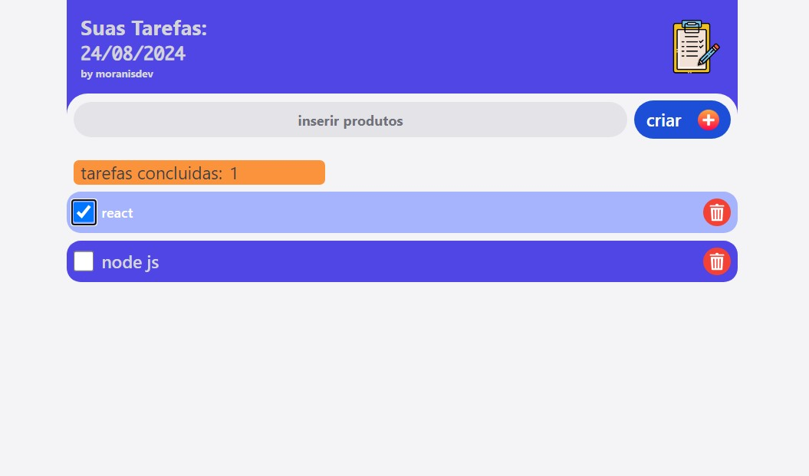

# Aplicação lista de tarefas.

Este projeto é uma aplicação de lista de tarefas (Todo List) desenvolvida utilizando **React.js** com **TypeScript**, oferecendo uma interface moderna e responsiva. A aplicação também conta com animações suaves utilizando **Framer Motion** para transição de componentes e navegação entre páginas implementada com **React Router DOM** na última versão.

Além do frontend, a aplicação está integrada com um backend que utiliza **PostgreSQL** como banco de dados, permitindo que as tarefas sejam salvas e recuperadas de forma persistente.

## Funcionalidades

- **Adição e remoção de tarefas**: Gerencie suas tarefas diárias de forma simples e intuitiva.
- **Edição de tarefas**: Atualize suas tarefas a qualquer momento.
- **Marcar como concluído**: Organize suas tarefas marcando as concluídas.

- **Persistência de dados**: As tarefas são armazenadas em um banco de dados PostgreSQL, garantindo que as informações permaneçam salvas entre sessões.

## Tecnologias Utilizadas

### Frontend:
- **React.js com TypeScript**: Framework e linguagem utilizada para a construção da interface de usuário.

### Backend:
- **Node.js com Fastify**:  Servidor backend que simplifica o gerenciamento de requisições e o fluxo de dados, oferecendo uma abordagem rápida e eficiente para o desenvolvimento de APIs.
- **PostgreSQL**: Banco de dados relacional utilizado para persistência das tarefas.

